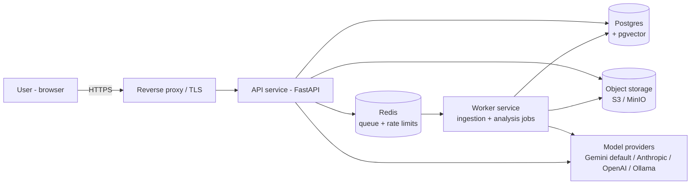
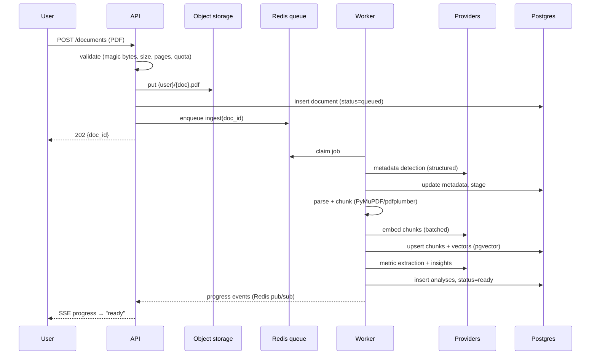
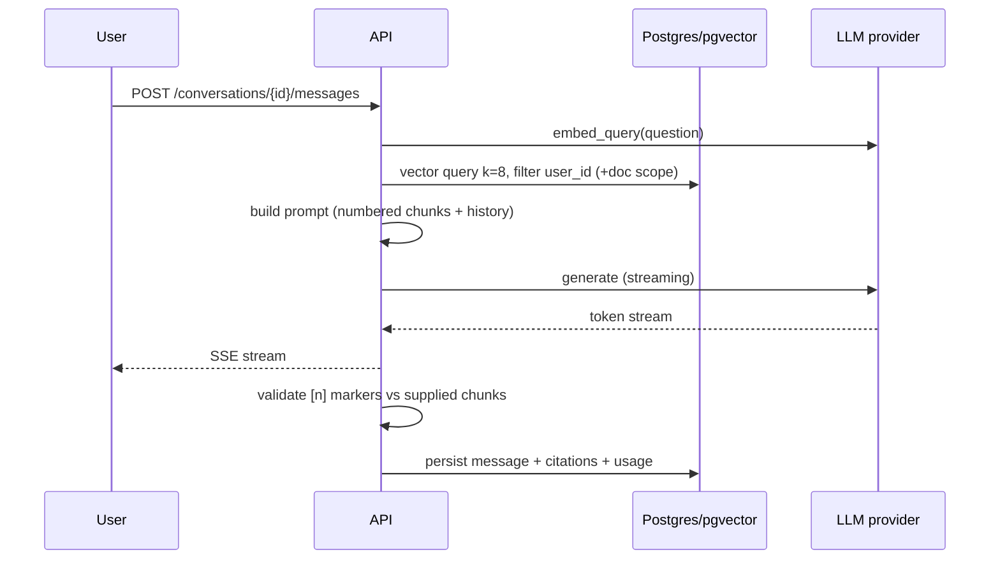

# AI Financial Analyzer — Architecture

Technical architecture for the system specified in [SPEC.md](SPEC.md). This document covers the *how*: components, request flows, data layout, the provider abstraction, deployment, and cross-cutting concerns.

---

## 1. System Context



Trust boundaries: everything left of `EXT` runs inside the deployment; model providers are external and receive document content (except in the `offline` profile, where Ollama + local embeddings keep all data on-machine).

---

## 2. Services

Two deployable services built from one codebase (same image, different entrypoint), plus managed state:

| Service | Responsibility | Scaling |
|---|---|---|
| **API** (FastAPI + Uvicorn) | Auth, CRUD, Q&A (retrieval + streaming generation), comparison orchestration, SSE, serving the htmx UI | Stateless; horizontal behind the proxy |
| **Worker** (arq on Redis) | Ingestion pipeline stages, (re)analysis jobs — anything long-running or rate-limit-throttled | Horizontal; concurrency capped per provider to respect rate limits |
| Postgres (+ pgvector) | Relational data + vector index | Managed instance / single node + backups |
| Redis | Job queue, rate-limit counters, SSE pub/sub for job progress | Single node (no durable data beyond queue) |
| Object storage | Original PDFs | S3/R2/MinIO |

**Why Q&A runs in the API, not the worker:** Q&A is interactive (streamed first token < 5s); it performs one retrieval + one streamed LLM call. Ingestion/analysis is minutes-long and rate-limited, so it belongs on the queue. Comparison sits in between — it runs in the API when metrics are already extracted (fast path), and queues a job when re-extraction is needed.

### Code layout

```
app/
  main.py               # FastAPI app factory
  worker.py             # arq worker entrypoint
  config/               # config.yaml loading, profiles, validation (pydantic-settings)
  providers/
    base.py             # LLMProvider / EmbeddingProvider / VectorStore protocols
    factory.py          # config → concrete adapters (built once at startup)
    llm/                # gemini.py, anthropic.py, openai.py, ollama.py
    embeddings/         # gemini.py, voyage.py, openai.py, local.py
    vectorstores/       # pgvector.py, chroma.py, qdrant.py, faiss.py
  domain/               # pure logic: chunking, delta math, citation parsing, schemas
  services/             # ingestion.py, analysis.py, qa.py, comparison.py
  api/                  # routers, auth, SSE, rate limiting
  db/                   # SQLAlchemy models, Alembic migrations
  storage/              # object-storage client (s3 | local)
  ui/                   # Jinja2 + htmx templates
tests/
  unit/                 # domain logic, citation parser, delta math
  integration/          # services against fake provider + testcontainers
  evals/                # Q&A + extraction eval fixtures
```

Dependency rule: `api`/`services` → `domain` + `providers/base`; only `providers/*` and `factory` import vendor SDKs. `domain` imports nothing above it and holds everything worth unit-testing heavily (chunker, citation validator, delta calculator).

---

## 3. Provider Abstraction

The heart of the configurability requirement. Application code depends on three protocols; a factory builds concrete adapters from `config.yaml` at startup and injects them.

```python
class LLMProvider(Protocol):
    def generate(self, system: str, messages: list[Message],
                 max_tokens: int) -> Iterator[str]              # streamed text
    def generate_structured(self, system: str, messages: list[Message],
                            schema: type[BaseModel]) -> BaseModel
    @property
    def supports_pdf_input(self) -> bool
    def attach_pdf(self, storage_key: str) -> ContentRef        # provider file upload, cached

class EmbeddingProvider(Protocol):
    def embed_documents(self, texts: list[str]) -> list[list[float]]
    def embed_query(self, text: str) -> list[float]
    @property
    def dimension(self) -> int

class VectorStore(Protocol):
    def upsert(self, chunks: list[ChunkRecord]) -> None
    def query(self, vector: list[float], k: int, filters: dict) -> list[ChunkHit]
    def delete_by_document(self, document_id: str) -> None
```

### Adapter responsibilities (what core code must never do)

| Concern | Where it lives |
|---|---|
| SDK calls, auth headers, file-upload mechanics | Adapter |
| Structured output: schema → provider mechanism (Gemini `response_schema`, OpenAI structured outputs, Anthropic `output_config.format`) + validation + one retry-on-invalid | Adapter |
| Rate-limit backoff (429-aware, exponential + jitter), provider error → typed app error (`ProviderRateLimited`, `ProviderUnavailable`, `ProviderRefusal`) | Adapter |
| Provider-specific optimizations: Anthropic prompt caching + adaptive thinking; Gemini context caching; Ollama JSON-mode retry loop | Adapter |
| Token/cost accounting → `usage` table (via a shared hook the adapter calls) | Adapter + shared hook |
| Prompt text, chunking, citation contract, delta math | Core (`domain`/`services`) — identical for all providers |

### Capability flags

- `supports_pdf_input` — Gemini / Anthropic / OpenAI attach the original PDF for analysis calls (financial tables read better visually); the returned provider file reference is cached on `documents.provider_file_ref` so upload happens once. Ollama and other text-only models fall back to parsed text automatically.
- The citation contract (`[n]` markers over numbered chunks) is the baseline all providers satisfy; adapters may internally upgrade to native citation features without changing the interface.

### Embedding-space guard

`index_meta` records `(embedding_provider, embedding_model, dimension)` for the index. At startup the factory compares config against `index_meta`: mismatch → hard error with a re-index command (`app reindex`), which re-embeds all chunks and swaps collections atomically. Vectors from different models are never mixed.

---

## 4. Request Flows

### 4.1 Ingestion (queued)



Stages are checkpointed (`documents.stage`); a retry resumes from the failed stage, not from zero. Worker concurrency per provider is capped so free-tier rate limits produce slow ingestion, never failed ingestion.

### 4.2 RAG Q&A (interactive, streamed)



### 4.3 Comparison

Metrics loaded from `analyses` (queued re-extraction if missing) → deltas/growth computed in `domain/deltas.py` (pure Python, unit-tested) → qualitative chunks retrieved per dimension per document → one narrative LLM call → stored result. The model never performs arithmetic; the computed table is passed to it read-only.

---

## 5. Data Architecture

### Postgres schema (canonical)

```sql
users          (id uuid PK, email citext UNIQUE, password_hash, created_at,
                quota_documents int NULL, quota_uploads_day int NULL, quota_questions_day int NULL)
documents      (id uuid PK, user_id FK→users, filename, storage_key, provider_file_ref text NULL,
                company, ticker NULL, report_type, fiscal_period, currency,
                page_count int, status enum(queued|processing|ready|failed),
                stage text, error text NULL, created_at)
chunks         (id uuid PK, document_id FK→documents ON DELETE CASCADE,
                section, page_start int, page_end int, text, token_count int, chunk_index int,
                embedding vector(D))                -- pgvector column; D from index_meta
index_meta     (embedding_provider, embedding_model, dimension int)  -- single row
analyses       (id uuid PK, user_id FK, type enum(metrics|insights|comparison),
                document_ids uuid[], result jsonb, provider, model, created_at)
conversations  (id uuid PK, user_id FK, document_ids uuid[], created_at)
messages       (id uuid PK, conversation_id FK, role, content text, citations jsonb, created_at)
usage          (id bigserial PK, user_id FK, kind enum(llm|embedding), provider, model,
                tokens_in int, tokens_out int, cost_estimate numeric, created_at)
refresh_tokens (id uuid PK, user_id FK, token_hash, expires_at, revoked_at NULL)
```

Indexes: `chunks` HNSW index on `embedding` (cosine) + btree on `(document_id)`; `documents (user_id, created_at)`; `usage (user_id, created_at)` for quota checks; partial index on `documents(status)` for worker dashboards.

When `vector_store.provider != pgvector` (Chroma/Qdrant/FAISS profiles), the `embedding` column is unused and the external store holds vectors + chunk metadata; Postgres `chunks.text` remains canonical either way.

### Object storage layout

```
{bucket}/
  {user_id}/{document_id}.pdf      # original upload, immutable
```

PDFs are private; the UI fetches them through short-lived signed URLs generated by the API. Deleting a document (or account) deletes objects, rows (cascade), vectors, and provider file references.

### Data lifecycle

| Event | Effect |
|---|---|
| Document delete | Object + chunks/vectors + analyses referencing only it + provider file ref, transactional where possible, idempotent cleanup job for the rest |
| Account delete | All of the above for every document + conversations + usage, completed ≤ 24h via a cleanup job |
| Embedding config change | Startup guard → explicit `reindex` run → new collection built → atomic swap |

---

## 6. Cross-Cutting Concerns

### Authentication & authorization

- Argon2id password hashing; JWT access tokens (15 min) + rotating refresh tokens (hashed in DB, revocable).
- Every repository/query method takes `user_id` and filters server-side — there is no code path that loads a resource by ID without an ownership predicate. Enforced by a repository-layer convention and an integration test that attempts cross-tenant access for every endpoint.

### Rate limiting & quotas

- Per-IP and per-user token-bucket limits in Redis at the API edge (auth endpoints stricter).
- Product quotas (documents stored, uploads/day, questions/day) checked against `documents`/`usage` counts before enqueueing work.

### Error handling

- Adapters normalize provider errors into a small typed set; the API maps them to stable error codes (`provider_rate_limited` → 429 with retry hint, `provider_unavailable` → 503, `provider_refusal` → 422 with explanation).
- Worker jobs: bounded retries with backoff per stage; poison jobs land in a dead-letter set with the error on the document row.
- Model-output failures (invalid JSON for a schema, hallucinated citation markers) are handled where they occur: one validation-retry inside the adapter, then a typed error — never silently passed through.

### Observability

- **Logs:** structlog JSON — request ID, user ID, route, latency; worker logs carry doc ID + stage. Document *content* never logged.
- **Metrics (Prometheus):** HTTP latency histograms per route; queue depth + job duration per stage; provider call latency, error and 429 counts, tokens per call; SSE stream counts.
- **Traces:** OpenTelemetry (optional exporter) spanning API → queue → worker → provider for one ingestion.
- **Errors:** Sentry-compatible SDK on both services.
- **Cost:** every adapter call writes `usage`; a small dashboard query gives per-user/per-day token spend.

### Prompt-injection posture

Document text is untrusted input. Mitigations: system prompts instruct the model to treat excerpts strictly as data; model output rendered as sanitized Markdown (no raw HTML); citation markers validated against the chunks actually supplied; tool use is not exposed to document-derived text (v1 has no model-triggered tools).

---

## 7. Deployment

### Topology

- **Single-host (default):** Docker Compose — `proxy` (Caddy, auto-TLS), `api` (N replicas), `worker` (N replicas), `postgres` (pgvector image), `redis`, `minio` (or external S3). Suits the v1 scale comfortably.
- **Scaled:** same images on any orchestrator (ECS/K8s); Postgres/Redis/storage move to managed services; API and worker scale independently (worker count is the ingestion-throughput knob, bounded by provider rate limits).

### Release & operations

| Concern | Approach |
|---|---|
| Build | One multi-stage Docker image; entrypoint selects `api` or `worker`; `uv` for locked dependencies |
| CI | lint (ruff) + typecheck (mypy) + unit/integration tests (fake provider + testcontainers Postgres) + eval set vs recorded responses |
| Migrations | Alembic, run as a release step before rollout; migrations are backward-compatible one release back (rolling deploys) |
| Deploy | Rolling restart behind health checks (`/healthz` liveness; `/readyz` checks DB, Redis, vector store) |
| Config | `config.yaml` mounted/baked per environment; secrets from env/secret manager only |
| Backups | Nightly `pg_dump` + object-storage versioning; restore drill is a P5 exit criterion |
| Runbooks | Provider outage (degrade to library-only), queue backlog (scale workers), re-index procedure, key rotation |

### Environment profiles

| | dev | prod | offline |
|---|---|---|---|
| Run | `docker compose --profile dev` or bare `uvicorn` + SQLite/Chroma, in-process jobs | Compose/orchestrator, full topology | bare metal, Ollama + local embeddings |
| Purpose | fast iteration, no external services required beyond a Gemini key | real deployments | air-gapped / private data |

---

## 8. Testing Strategy

| Layer | What | How |
|---|---|---|
| Unit | chunker, citation parser/validator, delta math, config validation | pure-Python, no I/O |
| Contract | every adapter passes one shared test suite per protocol (structured output round-trip, streaming, error normalization, backoff on fake 429s) | fake HTTP servers / recorded cassettes |
| Integration | services against `FakeLLMProvider` (deterministic canned outputs) + real Postgres/Redis via testcontainers; cross-tenant access denial per endpoint | CI |
| Evals | ≥20 Q&A pairs with expected citations + metric-extraction fixtures against known reports | CI vs recorded responses; on-demand vs live providers (both configured providers in P5) |
| Load | upload + Q&A mix at target concurrency; p95 assertions | pre-release, P5 |

The `FakeLLMProvider` is a first-class adapter (selected via config like any other), which keeps the entire stack testable without network access and doubles as the local-dev no-key mode.

---

## 9. Key Decisions & Trade-offs

| Decision | Choice | Trade-off accepted |
|---|---|---|
| Provider access | Hand-rolled protocol + adapters (LiteLLM optional inside the LLM adapter) | More code than LangChain/LiteLLM-everywhere; in exchange: no framework lock-in, debuggable, contract-testable |
| Vector store (prod) | pgvector | One database to operate/back up; ceiling lower than dedicated stores — acceptable at library scale (≤ ~10⁶ chunks), interface allows swap |
| Citations | Prompt-based `[n]` markers + server-side validation | Slightly weaker than provider-native citation APIs; works on every provider incl. local models |
| Jobs | arq (async, Redis) | Less ecosystem than Celery; async-native fits FastAPI, far less operational surface |
| UI | Server-rendered Jinja2 + htmx | Less rich than a SPA; one deployable, SSE-friendly, easily replaced later |
| Default LLM | Gemini 2.5 Flash free tier | Rate-limit throttled ingestion; zero cost by default, and the config system makes upgrading a one-line change |
