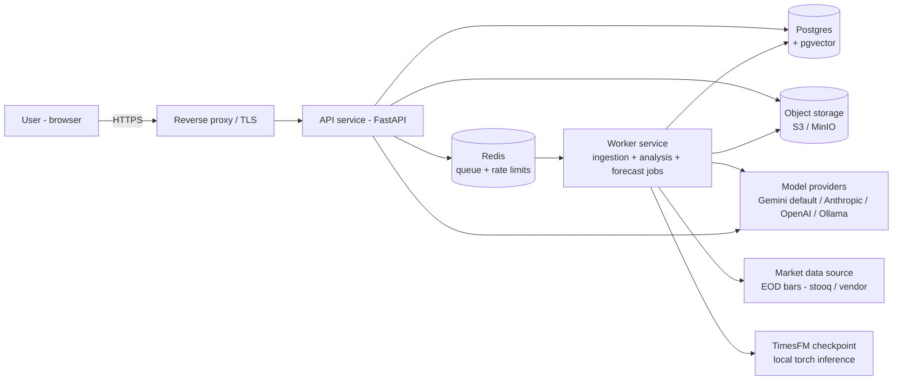
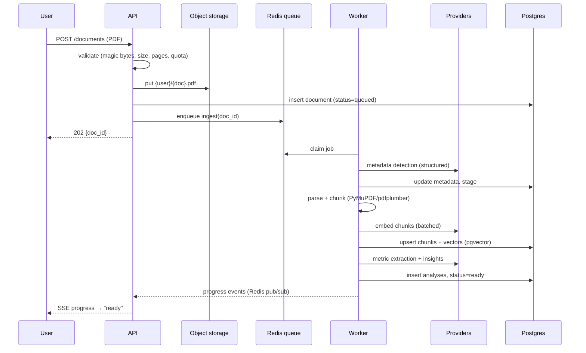
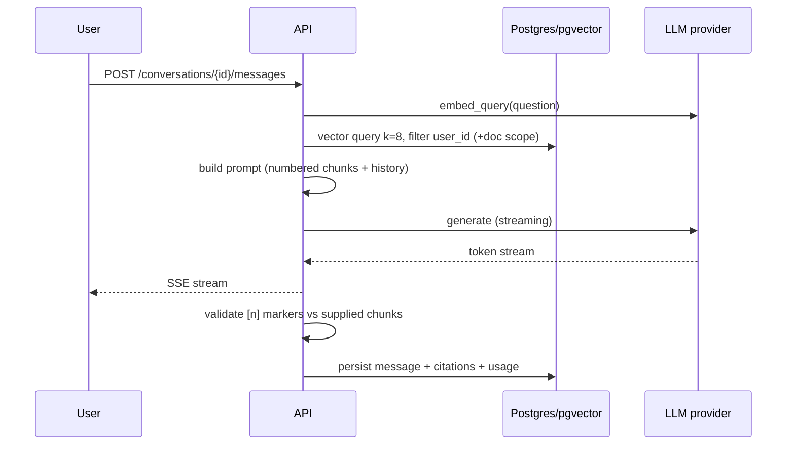
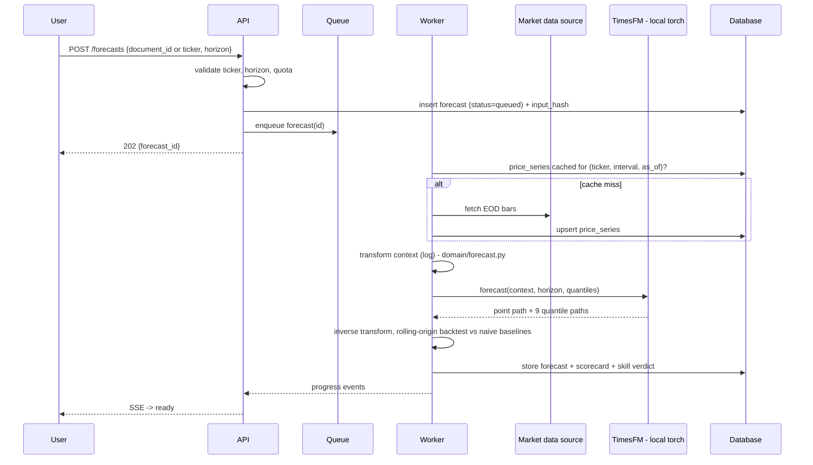

# AI Financial Analyzer — Architecture

Technical architecture for the system specified in [SPEC.md](SPEC.md). This document covers the *how*: components, request flows, data layout, the provider abstraction, deployment, and cross-cutting concerns.

---

## 1. System Context


```mermaid
flowchart LR
    U[User - browser] -->|HTTPS| LB[Reverse proxy / TLS]
    LB --> API[API service - FastAPI]
    API --> PG[(Postgres\n+ pgvector)]
    API --> RD[(Redis\nqueue + rate limits)]
    API --> S3[(Object storage\nS3 / MinIO)]
    RD --> W[Worker service\ningestion + analysis + forecast jobs]
    W --> PG
    W --> S3
    W --> EXT[Model providers\nGemini default / Anthropic / OpenAI / Ollama]
    W --> MD[Market data source\nEOD bars - stooq / vendor]
    W --> TFM[TimesFM checkpoint\nlocal torch inference]
    API --> EXT
```

Trust boundaries: everything left of `EXT` runs inside the deployment; model providers are external and receive document content (except in the `offline` profile, where Ollama + local embeddings keep all data on-machine). Two forecasting-specific notes: the market-data source is external but receives only a **ticker symbol** — never document or user content — and `TFM` is *not* an external service: TimesFM weights are downloaded once and run in-process, so price series never leave the deployment.

> The diagram shows the **scaled** topology. The **default is single-process**: one API process holds the SQLite database (via a file), an in-memory cache/queue/event bus, and local-disk PDF storage — no Postgres, Redis, or object store. Postgres/Redis/worker appear only when the `scaled` profile selects those backends (see §2, §7).

---

## 2. Services

The app has **two run modes**, chosen entirely by config (`database`, `cache`, `queue`, `events`, `object_storage`) — the same image builds both:

- **Single-process (default, `config/dev.yaml`).** One API process serves HTTP *and* runs ingestion jobs in-process (in-memory queue), backed by an in-memory cache and an in-memory SSE bus. State is a SQLite file + local disk. Zero external services.
- **Scaled (`config/scaled.yaml`).** API replicas + a separate arq worker, with Redis (cache + queue + SSE pub/sub) and Postgres (+ pgvector). Stateless API, horizontal on both tiers.

| Service | Responsibility | Present in |
|---|---|---|
| **API** (FastAPI + Uvicorn) | Auth, CRUD, Q&A (retrieval + streaming generation), comparison orchestration, SSE, htmx UI. In single-process mode, also runs ingestion jobs inline via the in-process queue. | always |
| **Worker** (arq) | Ingestion pipeline stages, (re)analysis jobs, and forecast jobs off the queue; concurrency capped per provider; holds the resident TimesFM model when forecasting is enabled | **scaled only** |
| Relational DB | Documents, chunks, analyses, conversations, usage | **SQLite** (default) → **Postgres (+ pgvector)** (scaled) |
| Cache / Queue / Event bus | Rate-limit counters, job dispatch, SSE progress fan-out | **in-memory / in-process** (default) → **Redis** (scaled) |
| Object storage | Original PDFs | **local disk** (default) → **S3/R2/MinIO** (scaled) |

**Why forecasts run in the worker, not the API:** a TimesFM forward pass is a synchronous, CPU-bound torch call — it would block the event loop for seconds and starve every concurrent request. Forecasts therefore always go through `TaskQueue`, exactly like ingestion: an arq worker when scaled, a thread executor inside the API process in single-process mode (which keeps the loop free even without a separate process). The model is loaded once at startup and kept resident; jobs never pay checkpoint-load cost.

**Why Q&A runs in the API, not the worker:** Q&A is interactive (streamed first token < 5s); it performs one retrieval + one streamed LLM call. Ingestion/analysis is minutes-long and rate-limited, so it goes through the queue. Comparison sits in between — it runs in the API when metrics are already extracted (fast path), and queues a job when re-extraction is needed.

**Single-process caveat:** with the `inprocess` queue there is no separate worker — ingestion runs as an in-process background task inside the API process. It shares the event loop with request handling, which is fine at low concurrency and is precisely the signal to switch the `queue`/`cache`/`events` backends to Redis (and split off a worker) as load grows. Because the queue is an interface, that switch is config-only.

### Code layout

```
app/
  main.py               # FastAPI app factory
  worker.py             # worker entrypoint (arq; scaled mode only)
  config/               # config.yaml loading, profiles, validation (pydantic-settings)
  providers/
    base.py             # LLMProvider / EmbeddingProvider / VectorStore protocols
    factory.py          # config → concrete adapters (built once at startup)
    llm/                # gemini.py, anthropic.py, openai.py, ollama.py
    embeddings/         # gemini.py, voyage.py, openai.py, local.py
    vectorstores/       # chroma.py, pgvector.py, qdrant.py, faiss.py
    forecast/           # naive.py (baselines), timesfm.py, fake.py
    marketdata/         # fixture.py, stooq.py, vendor.py
  infra/                # Cache / TaskQueue / EventBus interfaces + backends
    cache.py            #   memory | redis
    queue.py            #   inprocess | arq
    events.py           #   inprocess | redis
  domain/               # pure logic: chunking, delta math, citation parsing, schemas,
                        #   forecast transforms + backtest metrics
  services/             # ingestion.py, analysis.py, qa.py, comparison.py, forecasting.py
  api/                  # routers, auth, SSE, rate limiting
  db/                   # SQLAlchemy models, Alembic migrations (sqlite | postgres)
  storage/              # object-storage client (local | s3)
  ui/                   # Jinja2 + htmx templates
tests/
  unit/                 # domain logic, citation parser, delta math
  integration/          # services against fake provider + testcontainers
  evals/                # Q&A + extraction eval fixtures
```

Dependency rule: `api`/`services` → `domain` + the `providers`/`infra` interfaces; only `providers/*`, `infra/*`, and the factory import vendor SDKs (Gemini, `redis`, `arq`, `boto3`, `psycopg`, and — for forecasting — `timesfm`/`torch` and the market-data clients). `domain` imports nothing above it and holds everything worth unit-testing heavily (chunker, citation validator, delta calculator, forecast transforms + backtest metrics).

---

## 3. Provider Abstraction

The heart of the configurability requirement. Application code depends on three protocols; a factory builds concrete adapters from `config.yaml` at startup and injects them.

```python
class LLMProvider(Protocol):
    def generate(self, system: str, messages: list[Message],
                 max_tokens: int) -> Iterator[str]              # streamed text
    def generate_structured(self, system: str, messages: list[Message],
                            schema: type[BaseModel]) -> BaseModel
    @property
    def supports_pdf_input(self) -> bool
    def attach_pdf(self, storage_key: str) -> ContentRef        # provider file upload, cached

class EmbeddingProvider(Protocol):
    def embed_documents(self, texts: list[str]) -> list[list[float]]
    def embed_query(self, text: str) -> list[float]
    @property
    def dimension(self) -> int

class VectorStore(Protocol):
    def upsert(self, chunks: list[ChunkRecord]) -> None
    def query(self, vector: list[float], k: int, filters: dict) -> list[ChunkHit]
    def delete_by_document(self, document_id: str) -> None
```

Forecasting (F6) adds two more of the same shape — a data source and a model, kept separate so either can be swapped alone:

```python
class MarketDataProvider(Protocol):
    def fetch_series(self, ticker: str, start: date, end: date,
                     interval: str) -> PriceSeries          # normalized OHLCV bars + as_of
    @property
    def supports_intraday(self) -> bool

class ForecastProvider(Protocol):
    def forecast(self, contexts: Sequence[Sequence[float]], horizon: int,
                 quantiles: Sequence[float]) -> ForecastResult   # point path + quantile paths
    @property
    def max_context(self) -> int
    @property
    def supports_quantiles(self) -> bool
    @property
    def supports_covariates(self) -> bool
```

`ForecastResult` carries only arrays — no prose — which is why the `[n]`-citation machinery has no role in F6.

### Adapter responsibilities (what core code must never do)

| Concern | Where it lives |
|---|---|
| SDK calls, auth headers, file-upload mechanics | Adapter |
| Structured output: schema → provider mechanism (Gemini `response_schema`, OpenAI structured outputs, Anthropic `output_config.format`) + validation + one retry-on-invalid | Adapter |
| Rate-limit backoff (429-aware, exponential + jitter), provider error → typed app error (`ProviderRateLimited`, `ProviderUnavailable`, `ProviderRefusal`) | Adapter |
| Provider-specific optimizations: Anthropic prompt caching + adaptive thinking; Gemini context caching; Ollama JSON-mode retry loop | Adapter |
| Token/cost accounting → `usage` table (via a shared hook the adapter calls) | Adapter + shared hook |
| Checkpoint pin + download, `from_pretrained` / `compile(ForecastConfig(...))`, torch device + dtype, batching, keeping the model resident | Forecast adapter |
| Market-data HTTP + auth, vendor rate limits, symbol quirks (exchange suffixes, split/dividend-adjusted closes), bar normalization to `PriceSeries` | Market-data adapter |
| Prompt text, chunking, citation contract, delta math, forecast transforms + backtest metrics + skill verdict | Core (`domain`/`services`) — identical for all providers |

### Capability flags

- `supports_pdf_input` — Gemini / Anthropic / OpenAI attach the original PDF for analysis calls (financial tables read better visually); the returned provider file reference is cached on `documents.provider_file_ref` so upload happens once. Ollama and other text-only models fall back to parsed text automatically.
- The citation contract (`[n]` markers over numbered chunks) is the baseline all providers satisfy; adapters may internally upgrade to native citation features without changing the interface.
- `supports_quantiles` — TimesFM 2.5's continuous quantile head returns nine quantile paths alongside the point forecast. Providers without one report `False`, and `domain/forecast.py` reconstructs intervals from backtest residuals instead. Core code therefore *always* has a band to render — the uncertainty requirement never depends on the provider.
- `supports_covariates` — TimesFM 3.0 takes past-only and past-and-future covariates natively; 2.5 covers the same ground via XReg. Core code passes covariates only when the flag is set, so downgrading the checkpoint is a config change, not a crash.
- `max_context` — the adapter reports its own limit (TimesFM 2.5: up to 16k) and the service truncates the context to it, rather than any service hard-coding a window size.

### Embedding-space guard

`index_meta` records `(embedding_provider, embedding_model, dimension)` for the index. At startup the factory compares config against `index_meta`: mismatch → hard error with a re-index command (`app reindex`), which re-embeds all chunks and swaps collections atomically. Vectors from different models are never mixed.

### Forecast weights & the license guard

The embedding-space guard's sibling: same fail-fast posture, different failure mode. Before loading anything, the factory checks the configured checkpoint against a table of known weight licenses.

| Checkpoint | Weights license | Loads by default |
|---|---|---|
| `google/timesfm-2.5-200m-pytorch` (default) | Apache-2.0 | yes |
| `google/timesfm-2.0-*`, `google/timesfm-1.0-*` | Apache-2.0 | yes |
| `google/timesfm-3.0-pytorch` | `timesfm-non-commercial-license-v1.0` — non-commercial, **non-production** | only with `forecast.weights_license_ack: true` |

Unknown checkpoints are treated as restricted (deny by default). TimesFM's *source code* is Apache-2.0 in every case; it is the 3.0 weights that are encumbered — which is why a production-targeted app defaults to 2.5.

Two more boot-time checks ride along: `forecast.enabled: true` requires the `forecast` extra to be importable, and `max_context`/`max_horizon` must fall within the adapter's reported limits. All three fail at startup, none at request time.

### Infrastructure backends (same pattern as providers)

Database, cache, queue, and the SSE event bus are configurable backends behind interfaces — core code depends on the protocol, never on `redis`/`arq`/`psycopg`. Each ships an in-memory/in-process default and a Redis (or Postgres, for the DB) implementation.

```python
class Cache(Protocol):                 # rate-limit counters, ephemeral values
    async def get(self, key: str) -> str | None
    async def set(self, key: str, value: str, ttl_s: int | None = None) -> None
    async def incr(self, key: str, ttl_s: int) -> int   # atomic; used by rate limiting
    async def delete(self, key: str) -> None

class TaskQueue(Protocol):              # background jobs (ingestion/analysis)
    async def enqueue(self, job: str, **kwargs: object) -> str

class EventBus(Protocol):              # SSE progress fan-out
    async def publish(self, channel: str, event: dict) -> None
    def subscribe(self, channel: str) -> AsyncIterator[dict]
```

| Interface | Default backend | Scaled backend | Notes |
|---|---|---|---|
| Relational DB | SQLite (SQLAlchemy) | Postgres (+ pgvector) | Any SQLAlchemy URL; pgvector column exists only on Postgres (§5) |
| `Cache` | in-memory TTL dict | Redis | Rate-limit `incr` is atomic in both; the in-memory one is per-process |
| `TaskQueue` | `inprocess` (asyncio background task in the API) | `arq` (Redis) + worker | In-memory jobs die with the process — durability arrives with Redis |
| `EventBus` | in-memory asyncio broadcast | Redis pub/sub | In-memory fan-out only reaches subscribers in the same process |

**The in-memory backends are correct only single-process** — their state (queued jobs, rate counters, progress subscribers) lives in one process's memory. Selecting any Redis backend is what makes multiple API replicas + a separate worker coherent; the factory rejects a mixed config (e.g. `queue: arq` without a `url`) at startup.

---

## 4. Request Flows

### 4.1 Ingestion (queued)


```mermaid
sequenceDiagram
    participant U as User
    participant A as API
    participant S as Object storage
    participant Q as Redis queue
    participant W as Worker
    participant P as Providers
    participant DB as Postgres

    U->>A: POST /documents (PDF)
    A->>A: validate (magic bytes, size, pages, quota)
    A->>S: put {user}/{doc}.pdf
    A->>DB: insert document (status=queued)
    A->>Q: enqueue ingest(doc_id)
    A-->>U: 202 {doc_id}
    W->>Q: claim job
    W->>P: metadata detection (structured)
    W->>DB: update metadata, stage
    W->>W: parse + chunk (PyMuPDF/pdfplumber)
    W->>P: embed chunks (batched)
    W->>DB: upsert chunks + vectors (pgvector)
    W->>P: metric extraction + insights
    W->>DB: insert analyses, status=ready
    W-->>A: progress events (Redis pub/sub)
    A-->>U: SSE progress → "ready"
```

The diagram shows the scaled path. In single-process mode the queue is in-memory and these worker steps run as a background task inside the API process — same stages, same checkpoints. Stages are checkpointed (`documents.stage`); a retry resumes from the failed stage, not from zero. Worker concurrency per provider is capped so free-tier rate limits produce slow ingestion, never failed ingestion.

### 4.2 RAG Q&A (interactive, streamed)


```mermaid
sequenceDiagram
    participant U as User
    participant A as API
    participant DB as Postgres/pgvector
    participant P as LLM provider

    U->>A: POST /conversations/{id}/messages
    A->>P: embed_query(question)
    A->>DB: vector query k=8, filter user_id (+doc scope)
    A->>A: build prompt (numbered chunks + history)
    A->>P: generate (streaming)
    P-->>A: token stream
    A-->>U: SSE stream
    A->>A: validate [n] markers vs supplied chunks
    A->>DB: persist message + citations + usage
```

### 4.3 Comparison

Metrics loaded from `analyses` (queued re-extraction if missing) → deltas/growth computed in `domain/deltas.py` (pure Python, unit-tested) → qualitative chunks retrieved per dimension per document → one narrative LLM call → stored result. The model never performs arithmetic; the computed table is passed to it read-only.

### 4.4 Forecast (queued)


```mermaid
sequenceDiagram
    participant U as User
    participant A as API
    participant Q as Queue
    participant W as Worker
    participant MD as Market data source
    participant M as TimesFM - local torch
    participant DB as Database

    U->>A: POST /forecasts {document_id or ticker, horizon}
    A->>A: validate ticker, horizon, quota
    A->>DB: insert forecast (status=queued) + input_hash
    A->>Q: enqueue forecast(id)
    A-->>U: 202 {forecast_id}
    W->>DB: price_series cached for (ticker, interval, as_of)?
    alt cache miss
        W->>MD: fetch EOD bars
        W->>DB: upsert price_series
    end
    W->>W: transform context (log) - domain/forecast.py
    W->>M: forecast(context, horizon, quantiles)
    M-->>W: point path + 9 quantile paths
    W->>W: inverse transform, rolling-origin backtest vs naive baselines
    W->>DB: store forecast + scorecard + skill verdict
    W-->>A: progress events
    A-->>U: SSE -> ready
```

Every step except the model call is computed by the worker itself, and the model call returns arrays rather than prose — so nothing here can hallucinate a number. Narration (`POST /forecasts/{id}/narrate`) is a *separate*, API-side streamed LLM call over the already-stored table, subject to the same guardrails as Q&A.

**Implementation notes (P6, as built)** — decisions that refine the spec above; change them here first:

- **Where the model lives.** `build_providers(..., include_forecasting=not settings.is_multiprocess)`: in single-process mode the API process loads the providers and runs the job on its own loop via `asyncio.to_thread`; in the scaled profile only the arq worker builds them (`build_forecast_providers`), so API replicas never load ~1 GB of weights. The three boot checks run in whichever process loads the model.
- **`as_of` and dedupe.** `as_of` is the UTC calendar date of the request; it is part of `input_hash` together with the config identity (`forecast.provider/model/revision`, transform, context, quantiles, backtest windows, data source). Identical inputs while a `ready` artifact is younger than `forecast.cache_ttl_s` return it (HTTP 200); a stale or failed match is recomputed **in place** (same id, same URL) so the `(user_id, input_hash)` uniqueness holds and bookmarks survive. `price_series` rows are refreshed when older than `market_data.cache_ttl_s` — EOD vendors publish today's bar in the evening, so a same-day re-run can legitimately see one more close.
- **Provenance** on the row is written from the provider *object* at job start (`provider`, `model`, `checkpoint_revision`, `source`), overwriting the config placeholders the API inserted at request time.
- **Band source.** `naive` reports `supports_quantiles=False` on purpose, so the default configuration exercises the empirical-band path (per-step residual quantiles from the backtest, multiplicative in log space). `fake` and `timesfm` have quantile heads. `log_return` inverts per-step return quantiles cumulatively, which over-widens the band (perfectly correlated steps) — one reason `log` is the default.
- **Skill verdict** = relative MAE against the *best* naive baseline on the same origins, "better than naive" only above a 5% margin (`DEFAULT_SKILL_TOLERANCE`) — with eight origins a smaller edge is noise. Seasonal-naive uses one trading week (5 bars) for daily data. A series too short for `horizon × windows + 16` bars fails with a readable error rather than a smaller backtest.
- **Narration** today renders the stored table plus the linked document's detected metadata; the retrieved-chunk block plugs into the same prompt slot when the P3.2 retriever lands. Advice-seeking `focus` text is refused server-side (422) before any model call; the stream ends with the `forecast:{id}` citation.
- **Quota** counts requests that create or re-run a row per UTC day (`limits.quotas.forecasts_per_day`); dedupe hits are free. No per-user override column was added to `users` (P6 changes no existing table).
- **Default market source** (open question #7): `stooq` in `dev`/`scaled` (keyless EOD, split-adjusted), `fixture` in `test`/`offline`.
- **UI (P6.8)** is not built yet: there is no server-rendered UI layer at all until P2's document views land; the API already returns everything the chart needs (`dates`, `median`, `quantiles`, `backtest`, `skill`, `disclaimer`).

---

## 5. Data Architecture

### Relational schema (canonical)

Shown in Postgres types (the scaled target). On the **default SQLite** backend the ORM maps portable equivalents: `uuid[]` → JSON array, `jsonb` → JSON, `citext` → `TEXT COLLATE NOCASE`, and there is **no `vector(D)` column** — with SQLite the default vector store is Chroma, so vectors live there and `chunks.text` in the DB stays canonical. The `embedding` column below exists only when `vector_store.provider = pgvector`.

```sql
users          (id uuid PK, email citext UNIQUE, password_hash, created_at,
                quota_documents int NULL, quota_uploads_day int NULL, quota_questions_day int NULL)
documents      (id uuid PK, user_id FK→users, filename, storage_key, provider_file_ref text NULL,
                company, ticker NULL, report_type, fiscal_period, currency,
                page_count int, status enum(queued|processing|ready|failed),
                stage text, error text NULL, created_at)
chunks         (id uuid PK, document_id FK→documents ON DELETE CASCADE,
                section, page_start int, page_end int, text, token_count int, chunk_index int,
                embedding vector(D))                -- pgvector column; D from index_meta
index_meta     (embedding_provider, embedding_model, dimension int)  -- single row
analyses       (id uuid PK, user_id FK, type enum(metrics|insights|comparison),
                document_ids uuid[], result jsonb, provider, model, created_at)
conversations  (id uuid PK, user_id FK, document_ids uuid[], created_at)
messages       (id uuid PK, conversation_id FK, role, content text, citations jsonb, created_at)
usage          (id bigserial PK, user_id FK, kind enum(llm|embedding), provider, model,
                tokens_in int, tokens_out int, cost_estimate numeric, created_at)
refresh_tokens (id uuid PK, user_id FK, token_hash, expires_at, revoked_at NULL)
price_series   (ticker text, interval text, source text, as_of date,
                start_date date, end_date date, bars jsonb, fetched_at,
                PRIMARY KEY (ticker, interval, source, as_of))   -- global cache, deliberately no user_id
forecasts      (id uuid PK, user_id FK, document_id FK→documents NULL,
                ticker, interval, horizon int, transform text,
                provider, model, checkpoint_revision,
                context_start date, context_end date,
                point jsonb, quantiles jsonb, backtest jsonb, skill text,
                input_hash text, disclaimer_version int,
                status enum(queued|processing|ready|failed), error text NULL, created_at)
```

Indexes: `chunks` HNSW index on `embedding` (cosine) + btree on `(document_id)`; `documents (user_id, created_at)`; `usage (user_id, created_at)` for quota checks; partial index on `documents(status)` for worker dashboards; `forecasts (user_id, created_at)` plus a unique `(user_id, input_hash)` backing the dedupe path.

`price_series` is the one table with no `user_id`, on purpose: closing prices are public and identical for every tenant, so partitioning them per user would multiply third-party API calls to buy no isolation. Ownership attaches to `forecasts` — the artifact a user actually created — and every read of it is user-scoped like everything else.

When `vector_store.provider != pgvector` (Chroma/Qdrant/FAISS profiles), the `embedding` column is unused and the external store holds vectors + chunk metadata; Postgres `chunks.text` remains canonical either way.

### Object storage layout

```
{bucket}/
  {user_id}/{document_id}.pdf      # original upload, immutable
```

PDFs are private; the UI fetches them through short-lived signed URLs generated by the API. Deleting a document (or account) deletes objects, rows (cascade), vectors, and provider file references.

### Data lifecycle

| Event | Effect |
|---|---|
| Document delete | Object + chunks/vectors + analyses referencing only it + provider file ref, transactional where possible, idempotent cleanup job for the rest |
| Account delete | All of the above for every document + conversations + usage, completed ≤ 24h via a cleanup job |
| Embedding config change | Startup guard → explicit `reindex` run → new collection built → atomic swap |
| Forecast delete / account delete | `forecasts` rows removed with the rest of the user's data; `price_series` is untouched — a shared cache of public data, evicted by TTL, holding nothing user-identifying |
| Forecast weights/config change | Stored forecasts keep the `provider`/`model`/`checkpoint_revision` that produced them and are never silently re-attributed; a new config produces new artifacts (the `input_hash` includes it) |

---

## 6. Cross-Cutting Concerns

### Authentication & authorization

- Argon2id password hashing; JWT access tokens (15 min) + rotating refresh tokens (hashed in DB, revocable).
- Every repository/query method takes `user_id` and filters server-side — there is no code path that loads a resource by ID without an ownership predicate. Enforced by a repository-layer convention and an integration test that attempts cross-tenant access for every endpoint.

### Rate limiting & quotas

- Per-IP and per-user token-bucket limits in Redis at the API edge (auth endpoints stricter).
- Product quotas (documents stored, uploads/day, questions/day) checked against `documents`/`usage` counts before enqueueing work.

### Error handling

- Adapters normalize provider errors into a small typed set; the API maps them to stable error codes (`provider_rate_limited` → 429 with retry hint, `provider_unavailable` → 503, `provider_refusal` → 422 with explanation).
- Worker jobs: bounded retries with backoff per stage; poison jobs land in a dead-letter set with the error on the document row.
- Model-output failures (invalid JSON for a schema, hallucinated citation markers) are handled where they occur: one validation-retry inside the adapter, then a typed error — never silently passed through.

### Observability

- **Logs:** structlog JSON — request ID, user ID, route, latency; worker logs carry doc ID + stage. Document *content* never logged.
- **Metrics (Prometheus):** HTTP latency histograms per route; queue depth + job duration per stage; provider call latency, error and 429 counts, tokens per call; SSE stream counts.
- **Traces:** OpenTelemetry (optional exporter) spanning API → queue → worker → provider for one ingestion.
- **Errors:** Sentry-compatible SDK on both services.
- **Cost:** every adapter call writes `usage`; a small dashboard query gives per-user/per-day token spend.

### Prompt-injection posture

Document text is untrusted input. Mitigations: system prompts instruct the model to treat excerpts strictly as data; model output rendered as sanitized Markdown (no raw HTML); citation markers validated against the chunks actually supplied; tool use is not exposed to document-derived text (v1 has no model-triggered tools).

---

## 7. Deployment

### Topology

- **Single-process (default):** one `api` container — SQLite + in-memory cache/queue/events + a local-disk volume — optionally behind Caddy. `docker compose up` (base `docker-compose.yml`), or just `make run` with no containers at all. No Postgres/Redis/object store.
- **Scaled single-host:** base + `docker-compose.scaled.yml` (`make up-scaled`) layers on `postgres` (pgvector), `redis`, `minio`, and a separate `worker`, and points the app at `config/scaled.yaml`. Suits a small team on one box.
- **Scaled orchestrated:** same images on any orchestrator (ECS/K8s); Postgres/Redis/storage move to managed services; API and worker scale independently (worker count is the ingestion-throughput knob, bounded by provider rate limits).

### Release & operations

| Concern | Approach |
|---|---|
| Build | One multi-stage Docker image; entrypoint selects `api` or `worker`; `uv` for locked dependencies. Forecasting is opt-in at build time: the `forecast` extra (`timesfm[torch]`) roughly doubles image size, so it ships only in images built for a forecast-enabled profile, with the HuggingFace checkpoint cache on a persistent volume and warmed at startup rather than on first request |
| CI | lint (ruff) + typecheck (mypy) + unit/integration tests (fake provider + testcontainers Postgres) + eval set vs recorded responses |
| Migrations | Alembic, run as a release step before rollout; migrations are backward-compatible one release back (rolling deploys) |
| Deploy | Rolling restart behind health checks (`/healthz` liveness; `/readyz` checks DB, Redis, vector store) |
| Config | `config.yaml` mounted/baked per environment; secrets from env/secret manager only |
| Backups | Nightly `pg_dump` + object-storage versioning; restore drill is a P5 exit criterion |
| Runbooks | Provider outage (degrade to library-only), queue backlog (scale workers), re-index procedure, key rotation |

### Environment profiles

| | dev (default) | scaled | offline |
|---|---|---|---|
| Backends | SQLite + in-memory + local disk, single process | Postgres + Redis + S3, API replicas + worker | SQLite + in-memory, but Ollama + local embeddings |
| Run | `make run`, or `make up` | `make up-scaled` / orchestrator | bare metal, no API keys |
| Purpose | initial use; needs only a Gemini key (or none, with `offline`) | horizontal scaling | air-gapped / private data |

---

## 8. Testing Strategy

| Layer | What | How |
|---|---|---|
| Unit | chunker, citation parser/validator, delta math, config validation | pure-Python, no I/O |
| Contract | every adapter passes one shared test suite per protocol (structured output round-trip, streaming, error normalization, backoff on fake 429s) | fake HTTP servers / recorded cassettes |
| Integration | services against `FakeLLMProvider` (deterministic canned outputs) + real Postgres/Redis via testcontainers; cross-tenant access denial per endpoint | CI |
| Evals | ≥20 Q&A pairs with expected citations + metric-extraction fixtures against known reports | CI vs recorded responses; on-demand vs live providers (both configured providers in P5) |
| Forecast eval | fixture price series with known continuations; the configured provider scored against seasonal-naive and drift on MASE / sMAPE / pinball / coverage | CI on the `naive` provider (hermetic, no torch); on demand with `timesfm`. Asserts the metrics are computed correctly and relative skill hasn't regressed — **not** that the model beats the baseline |
| Load | upload + Q&A mix at target concurrency; p95 assertions | pre-release, P5 |

The `FakeLLMProvider` is a first-class adapter (selected via config like any other), which keeps the entire stack testable without network access and doubles as the local-dev no-key mode.

---

## 9. Key Decisions & Trade-offs

| Decision | Choice | Trade-off accepted |
|---|---|---|
| Provider access | Hand-rolled protocol + adapters (LiteLLM optional inside the LLM adapter) | More code than LangChain/LiteLLM-everywhere; in exchange: no framework lock-in, debuggable, contract-testable |
| Vector store | Chroma (default) → pgvector (scaled) | Chroma is zero-ops for single-process; pgvector keeps it to one database when on Postgres. Both behind the `VectorStore` interface — swap without touching core |
| Citations | Prompt-based `[n]` markers + server-side validation | Slightly weaker than provider-native citation APIs; works on every provider incl. local models |
| Jobs | in-process (default) → arq/Redis (scaled) | In-process jobs share the API loop and die with it — fine for initial use, and a config flip moves them to a durable Redis-backed worker |
| Initial infra / process model | SQLite + in-memory, single process | Zero external services to start; the DB and cache/queue/event backends are interfaces, so Postgres + Redis is a config change, not a rewrite. Trade-off: in-memory state is per-process, so scaling *requires* selecting the Redis backends |
| UI | Server-rendered Jinja2 + htmx | Less rich than a SPA; one deployable, SSE-friendly, easily replaced later |
| Default LLM | Gemini 2.5 Flash free tier | Rate-limit throttled ingestion; zero cost by default, and the config system makes upgrading a one-line change |
| Forecasting model | TimesFM, **zero-shot**, behind a `ForecastProvider` interface | No training pipeline, model registry, or retraining ops — and no ticker-specific tuning either. A fitted-model adapter (ARIMA, a trained net) can be added behind the same interface if that trade stops being worth it |
| Forecast weights | TimesFM 2.5 (Apache-2.0) rather than 3.0 | Gives up 3.0's native covariate support — the feature that would let fundamentals condition the forecast. 3.0's weights are non-commercial and non-production, which an app that calls itself production-ready cannot default to |
| Forecast presentation | Bands + backtest scorecard + skill verdict mandatory in every response | More to build and render than a single line on a chart. The alternative is a confident-looking curve with no error history, which is precisely this feature's most likely failure mode |
| Forecast default state | `forecast.enabled: false` | F6 is invisible until switched on, and the docs have to explain the extra. In exchange the zero-dependency default stays honest — torch and a 200M checkpoint are not "no external services" |
