# AI Financial Analyzer — Implementation Plan

Build plan for the system in [SPEC.md](SPEC.md) and [ARCHITECTURE.md](ARCHITECTURE.md). Organized as five phases (P1–P5) matching the spec milestones, broken into concrete tasks with dependencies and exit criteria. Each phase ends in something demoable.

**Sequencing principle:** build the seams first (config → providers → storage), then the vertical slice (ingest → analyze), then the interactive features (Q&A → compare), then harden. Every phase keeps the free Gemini default working end-to-end.

**Conventions:** tasks are sized ~½–2 days. `→` marks a hard dependency. Each task lists its "done when" check. Write tests alongside, not after — the `FakeLLMProvider` (P1.4) makes this cheap from day one.

---

## P0 — Project bootstrap (½ week)

Groundwork before feature work. No product behavior yet.

| # | Task | Done when |
|---|------|-----------|
| P0.1 | Repo scaffold: `app/` package per ARCHITECTURE §2 layout, `pyproject.toml`, `uv` lockfile, Python 3.12 | `uv sync` installs; `app` imports |
| P0.2 | Tooling: ruff (lint+format), mypy (strict on `domain/`), pytest, pre-commit hooks | `make check` runs lint+type+test clean on empty repo |
| P0.3 | CI pipeline (GitHub Actions): lint → typecheck → unit → integration (testcontainers Postgres) | CI green on an empty PR |
| P0.4 | Docker: one multi-stage image, entrypoint switch (`api`/`worker`); `docker-compose.yml` with proxy/api/worker/postgres/redis/minio | `docker compose up` boots all services, health checks pass |
| P0.5 | Dev ergonomics: `Makefile` / `justfile`, `.env.example`, README quickstart | New dev goes from clone → running app in < 10 min |

**Exit:** empty app boots locally and in CI; containers healthy.

---

## P1 — Foundation: config, providers, auth (1.5 weeks)

The abstraction seams. Nothing here is user-visible except auth, but everything later depends on it.

### Config system → P0.1
- **P1.1** `config/` — load `config.yaml` (path via `APP_CONFIG`), validate with pydantic-settings, resolve secret env-var names → values, expose typed `Settings`. Ship `dev`/`prod`/`offline` profile files.
  *Done when:* invalid config fails fast with a clear message; `Settings` is injectable.

### Provider protocols → P1.1
- **P1.2** `providers/base.py` — define `LLMProvider`, `EmbeddingProvider`, `VectorStore` protocols + shared types (`Message`, `ContentRef`, `ChunkRecord`, `ChunkHit`) and typed provider errors (`ProviderRateLimited`, `ProviderUnavailable`, `ProviderRefusal`).
  *Done when:* protocols type-check; no vendor imports in this module.
- **P1.3** `providers/factory.py` — build concrete adapters from `Settings`, once at startup, injected via FastAPI dependency.
  *Done when:* switching `llm.provider` in config yields a different adapter with no code change.

### Adapters → P1.2
- **P1.4** `FakeLLMProvider` + `FakeEmbeddingProvider` — deterministic canned outputs, selectable via config. This is the test/dev-no-key backbone; build it first.
  *Done when:* full stack runnable with zero API keys.
- **P1.5** **Gemini LLM adapter** (`google-genai`) — `generate` (streaming), `generate_structured` (`response_schema` + validate + one retry), `supports_pdf_input=True`, `attach_pdf` via Gemini File API, 429-aware backoff, usage hook.
  *Done when:* passes the shared adapter contract suite (P1.7); real call returns a validated Pydantic object.
- **P1.6** **Gemini embedding adapter** (`gemini-embedding-001`) — `embed_documents`/`embed_query`/`dimension`, batching, backoff.
  *Done when:* contract suite passes; dimension reported correctly.
- **P1.7** Shared **adapter contract test suite** — one suite each provider protocol must pass (structured round-trip, streaming, error normalization, backoff on fake 429). Runs against Fake + Gemini.
  *Done when:* both Gemini adapters + fakes are green.

### Persistence → P1.1
- **P1.8** DB layer — SQLAlchemy models per ARCHITECTURE §5, Alembic baseline migration, repository pattern with mandatory `user_id` scoping.
  *Done when:* migrate up/down clean; testcontainers Postgres in CI.
- **P1.9** pgvector `VectorStore` adapter + `index_meta` startup guard (mismatch → hard error + `reindex` command stub).
  *Done when:* upsert/query/delete round-trip a vector; embedding-model mismatch is caught at startup.
- **P1.10** Object storage abstraction (`s3` via boto3/MinIO, `local` for dev) + signed-URL generation.
  *Done when:* put/get/delete + signed URL work against MinIO and local disk.

### Auth → P1.8
- **P1.11** Auth: register/login/refresh/logout, Argon2id hashing, JWT access + rotating refresh (hashed, revocable), `delete /auth/account`.
  *Done when:* full auth cycle works; refresh rotation + revocation tested.
- **P1.12** API skeleton: FastAPI app factory, auth middleware, per-user + per-IP rate limiting (Redis token bucket), `/healthz` + `/readyz`, structured logging (structlog).
  *Done when:* authenticated request reaches a protected route; unauth is rejected; readiness checks DB/Redis/vector store.

**Exit (spec P1):** swapping `llm.model` in config changes behavior with no code change; authenticated CRUD on an empty library; CI green with tests against the fake provider.

---

## P2 — Ingest & analyze (2 weeks)

First real vertical slice. Upload a 10-K, get metrics + insights.

### Queue + pipeline → P1.*
- **P2.1** arq worker (`worker.py`) on Redis; job enqueue from API; Redis pub/sub for progress; SSE progress endpoint.
  *Done when:* an enqueued no-op job runs and streams progress to the browser.
- **P2.2** Upload endpoint `POST /documents` — multipart, validate (PDF magic bytes, size, page count, quota), store to object storage, insert `document(status=queued)`, enqueue ingest, return 202.
  *Done when:* bad files rejected with clear errors; good file lands in storage + DB + queue.

### Domain logic (pure, heavily unit-tested)
- **P2.3** `domain/chunking.py` — per-page text (PyMuPDF), section-heading detection with page-group fallback, ~800/100 token windows, table extraction (pdfplumber) → Markdown, chunk metadata.
  *Done when:* fixture PDFs produce expected chunk counts/sections; tables survive as Markdown; unit tests cover heading + fallback paths.
- **P2.4** `domain/schemas.py` — `FinancialMetrics`, `MoneyValue`, `SegmentRevenue`, metadata-detection schema.
  *Done when:* schemas validate/serialize; every metric nullable; `source_page` required on numbers.

### Ingestion stages → P2.1, P2.3, P1.5, P1.6, P1.9
- **P2.5** Stage 1–2: metadata detection (structured call, native-PDF-or-text per capability flag) → persist → user confirm/edit endpoint (`PATCH /documents/{id}`).
  *Done when:* metadata detected on a sample 10-K; editable in UI.
- **P2.6** Stage 3–4: run chunker → embed (batched) → upsert vectors; checkpoint `documents.stage`.
  *Done when:* chunks + vectors persisted; retry resumes from failed stage, not zero.
- **P2.7** Stage 5: metric extraction (`generate_structured`) + insight summary (streamed narrative) → `analyses`; `status=ready`.
  *Done when:* sample 10-K yields metrics table + insights, each with page references; `provider`/`model` recorded.
- **P2.8** Failure handling: per-stage bounded retries + backoff, poison → dead-letter + error on document row; `POST /documents/{id}/retry`.
  *Done when:* an injected stage failure surfaces a readable error and a working retry.

### UI → P2.*
- **P2.9** Library UI (Jinja2 + htmx): upload form, document list with live status (SSE), document detail (metadata, metrics panel, insights), delete.
  *Done when:* full upload → processing → ready → view flow works in the browser on the free Gemini config.

**Exit (spec P2):** upload a 10-K on the free Gemini config → metrics table + insights with page references; a failure shows a visible error and a working retry.

---

## P3 — RAG Q&A (1.5 weeks)

Interactive, cited, streamed question answering.

- **P3.1** `domain/citations.py` — build numbered-chunk prompt blocks (`[n] (Company FY2025, MD&A, pp. 41–43): …`); parse `[n]` markers from model output; validate against supplied chunks (strip+log unknowns) → citation objects with page refs.
  *Done when:* unit tests cover valid, missing, and hallucinated markers.
- **P3.2** Retriever (`services/qa.py`) — `embed_query` → vector `query(k=8, filters={user_id, document_ids?})`; weak-retrieval handling (widen k or honest "not found").
  *Done when:* scoped and library-wide retrieval return expected chunks; cross-user leakage test passes.
- **P3.3** Conversations: `POST /conversations` (with doc scope), `POST /conversations/{id}/messages` streaming (SSE), history persisted + resent for multi-turn.
  *Done when:* multi-turn follow-up uses prior context; messages + citations stored.
- **P3.4** Q&A prompt + guardrails (system prompt: answer only from excerpts, refuse when unsupported, never extrapolate, no advice); render sanitized Markdown; citation chips linking to PDF page via signed URL.
  *Done when:* answers cite pages; unanswerable questions are refused, not fabricated.
- **P3.5** Eval harness (`tests/evals/`) — ≥20 Q&A pairs with expected citations on a known report; runs vs recorded responses in CI, on-demand vs live.
  *Done when:* eval set runs in CI and reports pass rate.

**Exit (spec P3):** 10 varied questions on one report → grounded, cited answers; unanswerable questions refused; eval set green in CI.

---

## P4 — Comparison (1 week)

- **P4.1** `domain/deltas.py` — pure-Python delta + growth-rate computation over two+ `FinancialMetrics`, currency/unit normalization, missing-metric handling. Heavily unit-tested (the model never does arithmetic).
  *Done when:* known metric pairs produce correct deltas/growth; edge cases (nulls, unit mismatch) covered.
- **P4.2** `POST /compare` — load metrics per doc (queue re-extraction if missing), compute table, retrieve qualitative chunks per dimension per doc, one narrative call; store as `analyses(type=comparison)`.
  *Done when:* two 10-Ks produce a computed table + coherent narrative; ≤5 docs enforced.
- **P4.3** Comparison UI — multi-select from library, delta table, narrative, per-metric source pages.
  *Done when:* FY2024 vs FY2025 comparison renders correctly in the browser.

**Exit (spec P4):** FY2024 vs FY2025 10-K of one company → correct delta table + coherent narrative.

---

## P5 — Production hardening (2 weeks)

Prove the abstraction, then make it operable.

### Second provider (proves the interface) → P1.7
- **P5.1** Second LLM adapter — **Anthropic** (`claude-opus-4-8`: Files API native PDF, `output_config.format` structured, adaptive thinking, prompt caching, streaming) **or Ollama** (text-path, JSON-mode + validation retry). Must pass the P1.7 contract suite unchanged.
  *Done when:* the P3 eval set passes under both provider configs.
- **P5.2** (optional) Voyage + local embedding adapters; `reindex` command fully implemented (atomic collection swap).
  *Done when:* switching embedding provider + reindex produces a working index; guard prevents mixed spaces.

### Operability → P2–P4
- **P5.3** Quotas + rate limits enforced end-to-end (documents, uploads/day, questions/day) with clear 429s.
- **P5.4** Observability: Prometheus metrics (HTTP latency, queue depth, stage durations, provider latency/error/429, tokens); `usage` table + per-user cost dashboard query; Sentry on both services; OpenTelemetry ingestion trace.
- **P5.5** Security pass: signed-URL-only PDF access, upload hardening, prompt-injection review (Markdown sanitization, marker validation), secret-handling audit, cross-tenant denial test per endpoint.
- **P5.6** Ops: Alembic release step, rolling deploy with health gates, nightly `pg_dump` + object-versioning, **restore drill**, runbooks (provider outage, queue backlog, reindex, key rotation).
- **P5.7** Load test: upload + Q&A mix at target concurrency; assert p95 targets (Q&A first token < 5s, API reads < 300ms).

**Exit (spec P5):** same eval set passes under two provider configs; restore drill documented; p95 targets met under load.

---

## Timeline & critical path

```mermaid
gantt
    dateFormat  X
    axisFormat  wk %s
    section Foundation
    P0 bootstrap        :0, 1
    P1 config/providers/auth :1, 3
    section Vertical slice
    P2 ingest & analyze :3, 5
    P3 RAG Q&A          :5, 7
    section Features
    P4 comparison       :7, 8
    P5 hardening        :8, 10
```

**~10 weeks** for one engineer building sequentially; faster with parallelism (UI vs pipeline in P2; second adapter vs ops in P5).

**Critical path:** P1.1 config → P1.2/1.3 provider seam → P1.5 Gemini adapter → P2.5–2.7 ingestion stages → P3.2 retriever → P4.1 deltas. Everything else (UI, storage, auth, observability) can proceed alongside once the seam exists.

**Parallelizable early:** auth (P1.11–12), object storage (P1.10), and DB (P1.8) have no dependency on the provider adapters and can be built in parallel with P1.5–1.7.

---

## Risks & mitigations

| Risk | Impact | Mitigation |
|---|---|---|
| Free-tier rate limits stall ingestion | Slow/failed ingest of large reports | Worker concurrency cap + backoff (built in P2.1/adapters); throttling surfaces as progress, never failure; document the cap |
| PDF parsing quality varies (scanned, exotic layouts) | Bad chunks → bad retrieval | Native-PDF path for analysis sidesteps text-scrape; OCR fallback deferred (SPEC §9.1); fixture-driven chunker tests |
| Structured output unreliable on weaker/local models | Extraction fails schema | Adapter validation + one retry; Ollama JSON-mode loop; keep Gemini as the quality default |
| Provider API drift (SDK/model changes) | Adapter breaks | Contract suite (P1.7) catches drift; adapters are the only vendor-coupled code |
| Embedding config change corrupts index | Mixed vector spaces → silent bad retrieval | `index_meta` startup guard + explicit `reindex` (P1.9/P5.2) |
| Model hallucinates citations/numbers | Untrustworthy output | Marker validation (P3.1), nullable-metrics + `source_page` (P2.4), Python-computed deltas (P4.1) |

---

## Definition of done (v1)

- Free Gemini config works end-to-end (upload → analyze → ask → compare) with zero model cost.
- A second provider config passes the same eval set — the abstraction is proven, not just claimed.
- Multi-user isolation verified by per-endpoint cross-tenant denial tests.
- Observability, quotas, backups+restore drill, and p95 targets in place.
- CI green: lint, typecheck, unit, integration, eval set.
