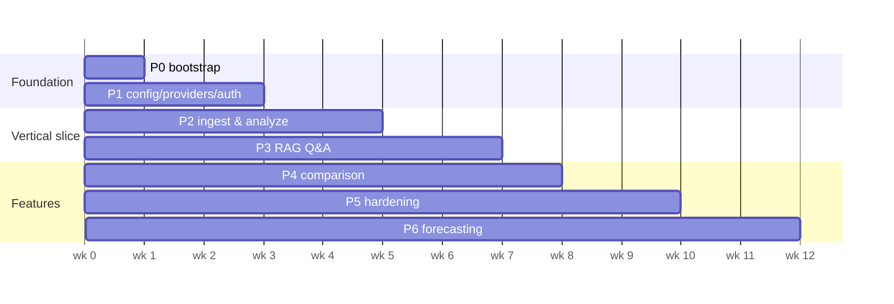

# AI Financial Analyzer — Implementation Plan

Build plan for the system in [SPEC.md](SPEC.md) and [ARCHITECTURE.md](ARCHITECTURE.md). Organized as six phases (P1–P6) matching the spec milestones, broken into concrete tasks with dependencies and exit criteria. Each phase ends in something demoable.

**Sequencing principle:** build the seams first (config → providers → storage), then the vertical slice (ingest → analyze), then the interactive features (Q&A → compare), then harden. Every phase keeps the free Gemini default working end-to-end.

**Conventions:** tasks are sized ~½–2 days. `→` marks a hard dependency. Each task lists its "done when" check. Write tests alongside, not after — the `FakeLLMProvider` (P1.4) makes this cheap from day one.

---

## P0 — Project bootstrap (½ week)

Groundwork before feature work. No product behavior yet.

| # | Task | Done when |
|---|------|-----------|
| P0.1 | Repo scaffold: `app/` package per ARCHITECTURE §2 layout, `pyproject.toml`, `uv` lockfile, Python 3.12 | `uv sync` installs; `app` imports |
| P0.2 | Tooling: ruff (lint+format), mypy (strict on `domain/`), pytest, pre-commit hooks | `make check` runs lint+type+test clean on empty repo |
| P0.3 | CI pipeline (GitHub Actions): lint → typecheck → unit → integration (testcontainers Postgres) | CI green on an empty PR |
| P0.4 | Docker: one multi-stage image, entrypoint switch (`api`/`worker`); base `docker-compose.yml` (single-process: api + proxy, SQLite/local volume) + `docker-compose.scaled.yml` override (postgres/redis/minio/worker) | base `docker compose up` boots api healthy; scaled override adds the rest |
| P0.5 | Dev ergonomics: `Makefile` / `justfile`, `.env.example`, README quickstart | New dev goes from clone → running app in < 10 min |

**Exit:** empty app boots locally and in CI; containers healthy.

---

## P1 — Foundation: config, providers, auth (1.5 weeks)

The abstraction seams. Nothing here is user-visible except auth, but everything later depends on it.

### Config system → P0.1
- **P1.1** `config/` — load `config.yaml` (path via `APP_CONFIG`), validate with pydantic-settings, resolve secret env-var names → values, expose typed `Settings`. Ship `dev`/`prod`/`offline` profile files.
  *Done when:* invalid config fails fast with a clear message; `Settings` is injectable.

### Provider protocols → P1.1
- **P1.2** `providers/base.py` — define `LLMProvider`, `EmbeddingProvider`, `VectorStore` protocols + shared types (`Message`, `ContentRef`, `ChunkRecord`, `ChunkHit`) and typed provider errors (`ProviderRateLimited`, `ProviderUnavailable`, `ProviderRefusal`).
  *Done when:* protocols type-check; no vendor imports in this module.
- **P1.3** `providers/factory.py` — build concrete adapters from `Settings`, once at startup, injected via FastAPI dependency.
  *Done when:* switching `llm.provider` in config yields a different adapter with no code change.

### Adapters → P1.2
- **P1.4** `FakeLLMProvider` + `FakeEmbeddingProvider` — deterministic canned outputs, selectable via config. This is the test/dev-no-key backbone; build it first.
  *Done when:* full stack runnable with zero API keys.
- **P1.5** **Gemini LLM adapter** (`google-genai`) — `generate` (streaming), `generate_structured` (`response_schema` + validate + one retry), `supports_pdf_input=True`, `attach_pdf` via Gemini File API, 429-aware backoff, usage hook.
  *Done when:* passes the shared adapter contract suite (P1.7); real call returns a validated Pydantic object.
- **P1.6** **Gemini embedding adapter** (`gemini-embedding-001`) — `embed_documents`/`embed_query`/`dimension`, batching, backoff.
  *Done when:* contract suite passes; dimension reported correctly.
- **P1.7** Shared **adapter contract test suite** — one suite each provider protocol must pass (structured round-trip, streaming, error normalization, backoff on fake 429). Runs against Fake + Gemini.
  *Done when:* both Gemini adapters + fakes are green.

### Persistence → P1.1
- **P1.8** DB layer — SQLAlchemy models per ARCHITECTURE §5, **SQLite default** (any SQLAlchemy URL; Postgres for the scaled profile), Alembic baseline migration, repository pattern with mandatory `user_id` scoping. Use portable column types (arrays/jsonb→JSON, citext→NOCASE text) so the same models run on both engines.
  *Done when:* migrate up/down clean on SQLite **and** Postgres; every repository method is user-scoped.
- **P1.9** `VectorStore` adapter — **Chroma** (default, local) + `index_meta` startup guard (mismatch → hard error + `reindex` command stub); pgvector adapter behind the same interface for the scaled profile.
  *Done when:* upsert/query/delete round-trip a vector on Chroma; embedding-model mismatch caught at startup; pgvector passes the same VectorStore contract.
- **P1.10** Infra backends — `Cache` / `TaskQueue` / `EventBus` interfaces with **in-memory / in-process defaults** + Redis backends; factory wiring + startup validation (reject a Redis backend with no URL; reject in-memory backends when configured for multi-process).
  *Done when:* a rate-limit counter, a background job, and a progress event each work on the in-memory backend; the Redis backend passes the same interface tests.
- **P1.11** Object storage abstraction (`local` default, `s3` via boto3/MinIO) + signed-URL generation.
  *Done when:* put/get/delete + signed URL work against local disk and MinIO.

### Auth → P1.8
- **P1.12** Auth: register/login/refresh/logout, Argon2id hashing, JWT access + rotating refresh (hashed, revocable), `delete /auth/account`.
  *Done when:* full auth cycle works; refresh rotation + revocation tested.
- **P1.13** API skeleton: FastAPI app factory, auth middleware, per-user + per-IP rate limiting **via the `Cache` interface (in-memory default)**, `/healthz` + `/readyz`, structured logging (structlog).
  *Done when:* authenticated request reaches a protected route; unauth is rejected; readiness checks the DB, vector store, and (when selected) Redis.

**Exit (spec P1):** swapping `llm.model` in config changes behavior with no code change; switching `database`/`cache`/`queue`/`events` to the Postgres/Redis backends is config-only; authenticated CRUD on an empty library; CI green with tests against the fake provider on SQLite + in-memory.

---

## P2 — Ingest & analyze (2 weeks)

First real vertical slice. Upload a 10-K, get metrics + insights.

### Queue + pipeline → P1.*
- **P2.1** arq worker (`worker.py`) on Redis; job enqueue from API; Redis pub/sub for progress; SSE progress endpoint.
  *Done when:* an enqueued no-op job runs and streams progress to the browser.
- **P2.2** Upload endpoint `POST /documents` — multipart, validate (PDF magic bytes, size, page count, quota), store to object storage, insert `document(status=queued)`, enqueue ingest, return 202.
  *Done when:* bad files rejected with clear errors; good file lands in storage + DB + queue.

### Domain logic (pure, heavily unit-tested)
- **P2.3** `domain/chunking.py` — per-page text (PyMuPDF), section-heading detection with page-group fallback, ~800/100 token windows, table extraction (pdfplumber) → Markdown, chunk metadata.
  *Done when:* fixture PDFs produce expected chunk counts/sections; tables survive as Markdown; unit tests cover heading + fallback paths.
- **P2.4** `domain/schemas.py` — `FinancialMetrics`, `MoneyValue`, `SegmentRevenue`, metadata-detection schema.
  *Done when:* schemas validate/serialize; every metric nullable; `source_page` required on numbers.

### Ingestion stages → P2.1, P2.3, P1.5, P1.6, P1.9
- **P2.5** Stage 1–2: metadata detection (structured call, native-PDF-or-text per capability flag) → persist → user confirm/edit endpoint (`PATCH /documents/{id}`).
  *Done when:* metadata detected on a sample 10-K; editable in UI.
- **P2.6** Stage 3–4: run chunker → embed (batched) → upsert vectors; checkpoint `documents.stage`.
  *Done when:* chunks + vectors persisted; retry resumes from failed stage, not zero.
- **P2.7** Stage 5: metric extraction (`generate_structured`) + insight summary (streamed narrative) → `analyses`; `status=ready`.
  *Done when:* sample 10-K yields metrics table + insights, each with page references; `provider`/`model` recorded.
- **P2.8** Failure handling: per-stage bounded retries + backoff, poison → dead-letter + error on document row; `POST /documents/{id}/retry`.
  *Done when:* an injected stage failure surfaces a readable error and a working retry.

### UI → P2.*
- **P2.9** Library UI (Jinja2 + htmx): upload form, document list with live status (SSE), document detail (metadata, metrics panel, insights), delete.
  *Done when:* full upload → processing → ready → view flow works in the browser on the free Gemini config.

**Exit (spec P2):** upload a 10-K on the free Gemini config → metrics table + insights with page references; a failure shows a visible error and a working retry.

---

## P3 — RAG Q&A (1.5 weeks)

Interactive, cited, streamed question answering.

- **P3.1** `domain/citations.py` — build numbered-chunk prompt blocks (`[n] (Company FY2025, MD&A, pp. 41–43): …`); parse `[n]` markers from model output; validate against supplied chunks (strip+log unknowns) → citation objects with page refs.
  *Done when:* unit tests cover valid, missing, and hallucinated markers.
- **P3.2** Retriever (`services/qa.py`) — `embed_query` → vector `query(k=8, filters={user_id, document_ids?})`; weak-retrieval handling (widen k or honest "not found").
  *Done when:* scoped and library-wide retrieval return expected chunks; cross-user leakage test passes.
- **P3.3** Conversations: `POST /conversations` (with doc scope), `POST /conversations/{id}/messages` streaming (SSE), history persisted + resent for multi-turn.
  *Done when:* multi-turn follow-up uses prior context; messages + citations stored.
- **P3.4** Q&A prompt + guardrails (system prompt: answer only from excerpts, refuse when unsupported, never extrapolate, no advice); render sanitized Markdown; citation chips linking to PDF page via signed URL.
  *Done when:* answers cite pages; unanswerable questions are refused, not fabricated.
- **P3.5** Eval harness (`tests/evals/`) — ≥20 Q&A pairs with expected citations on a known report; runs vs recorded responses in CI, on-demand vs live.
  *Done when:* eval set runs in CI and reports pass rate.

**Exit (spec P3):** 10 varied questions on one report → grounded, cited answers; unanswerable questions refused; eval set green in CI.

---

## P4 — Comparison (1 week)

- **P4.1** `domain/deltas.py` — pure-Python delta + growth-rate computation over two+ `FinancialMetrics`, currency/unit normalization, missing-metric handling. Heavily unit-tested (the model never does arithmetic).
  *Done when:* known metric pairs produce correct deltas/growth; edge cases (nulls, unit mismatch) covered.
- **P4.2** `POST /compare` — load metrics per doc (queue re-extraction if missing), compute table, retrieve qualitative chunks per dimension per doc, one narrative call; store as `analyses(type=comparison)`.
  *Done when:* two 10-Ks produce a computed table + coherent narrative; ≤5 docs enforced.
- **P4.3** Comparison UI — multi-select from library, delta table, narrative, per-metric source pages.
  *Done when:* FY2024 vs FY2025 comparison renders correctly in the browser.

**Exit (spec P4):** FY2024 vs FY2025 10-K of one company → correct delta table + coherent narrative.

---

## P5 — Production hardening (2 weeks)

Prove the abstraction, then make it operable.

### Second provider (proves the interface) → P1.7
- **P5.1** Second LLM adapter — **Anthropic** (`claude-opus-4-8`: Files API native PDF, `output_config.format` structured, adaptive thinking, prompt caching, streaming) **or Ollama** (text-path, JSON-mode + validation retry). Must pass the P1.7 contract suite unchanged.
  *Done when:* the P3 eval set passes under both provider configs.
- **P5.2** (optional) Voyage + local embedding adapters; `reindex` command fully implemented (atomic collection swap).
  *Done when:* switching embedding provider + reindex produces a working index; guard prevents mixed spaces.

### Operability → P2–P4
- **P5.3** Quotas + rate limits enforced end-to-end (documents, uploads/day, questions/day) with clear 429s.
- **P5.4** Observability: Prometheus metrics (HTTP latency, queue depth, stage durations, provider latency/error/429, tokens); `usage` table + per-user cost dashboard query; Sentry on both services; OpenTelemetry ingestion trace.
- **P5.5** Security pass: signed-URL-only PDF access, upload hardening, prompt-injection review (Markdown sanitization, marker validation), secret-handling audit, cross-tenant denial test per endpoint.
- **P5.6** Ops: Alembic release step, rolling deploy with health gates, nightly `pg_dump` + object-versioning, **restore drill**, runbooks (provider outage, queue backlog, reindex, key rotation).
- **P5.7** Load test: upload + Q&A mix at target concurrency; assert p95 targets (Q&A first token < 5s, API reads < 300ms).

**Exit (spec P5):** same eval set passes under two provider configs; restore drill documented; p95 targets met under load.

---

## P6 — Market forecasting (1.5 weeks)

**Status:** P6.1–P6.7 and P6.9 implemented (API-complete, tested on the `naive`/`fake` providers with hermetic fixture bars; the TimesFM adapter is written against the 2.5 torch API and gated behind the `forecast` extra). P6.8 (UI) waits for the UI layer from P2. Decisions that refine the spec are recorded in ARCHITECTURE.md §4.4 "Implementation notes".

Adds the F6 flow (SPEC §3.6). Built in the same order as P1 — interfaces, fakes, and baselines first, the real model last — so nothing downstream ever depends on torch being installed.

### Seams → P1.1–P1.3
- **P6.1** `providers/base.py` additions — `MarketDataProvider` / `ForecastProvider` protocols, shared types (`Bar`, `PriceSeries`, `ForecastResult`), typed errors (`TickerNotFound`, `MarketDataUnavailable`, `ForecastUnavailable`). New `market_data` + `forecast` config blocks with boot-time validation: extra importable when enabled, weights-license ack, `max_context`/`max_horizon` within the adapter's limits.
  *Done when:* protocols type-check with zero vendor imports; each of the three invalid configs fails at startup with a distinct, readable message.
- **P6.2** `providers/marketdata/` — `fixture.py` (hermetic, CI) + one live adapter (`stooq`): normalize vendor bars to `PriceSeries`, split/dividend-adjusted closes, `as_of` stamping, backoff. Global `price_series` cache table + repository — the one repository deliberately *not* user-scoped (ARCHITECTURE §5).
  *Done when:* fixture adapter serves CI with no network; the live adapter passes the same contract suite; a repeat fetch inside the TTL hits the cache instead of the vendor.

### Domain math (pure, heavily unit-tested) → P6.1
- **P6.3** `domain/forecast.py` — transforms (`level|log|log_return`) and their inverses; naive baselines (last-value/drift, seasonal-naive); rolling-origin backtest; MASE, sMAPE, pinball loss, interval coverage; skill verdict; empirical bands from backtest residuals.
  *Done when:* transforms round-trip to float tolerance; every metric matches a hand-computed fixture; flat/trending/noisy series produce the expected baseline scores; clean under the strict `app.domain.*` mypy overrides.
- **P6.4** `providers/forecast/naive.py` + `fake.py` — the baselines exposed *as* a `ForecastProvider`, so `forecast.provider: naive` is a fully working configuration with zero extra dependencies.
  *Done when:* the entire F6 flow runs end-to-end with torch not installed.

### TimesFM adapter → P6.1, P6.3
- **P6.5** `providers/forecast/timesfm.py` — `TimesFM_2p5_200M_torch.from_pretrained(model, revision)` + `compile(ForecastConfig(max_context, max_horizon, normalize_inputs, use_continuous_quantile_head, fix_quantile_crossing, ...))`, device selection, batched `forecast(horizon, inputs)` → `ForecastResult`, model held resident, checkpoint pinned by revision. Adds the `forecast` extra (`timesfm[torch]`) to `pyproject.toml`, the `timesfm.*`/`torch.*` mypy `ignore_missing_imports` entries, and the license-guard table.
  *Done when:* passes the same `ForecastProvider` contract suite as the naive adapter, unchanged; 3.0 weights refuse to load without `weights_license_ack: true`; swapping `naive` → `timesfm` touches no code outside config.

### Service, API, UI → P6.2–P6.5
- **P6.6** `services/forecasting.py` + queued job — ticker resolution from `documents.ticker`, quota and horizon checks, `input_hash` dedupe, price fetch, transform, **inference off the event loop** (thread executor in-process, arq worker when scaled), backtest, persist, SSE progress. Endpoints `POST /forecasts`, `GET /forecasts`, `GET /forecasts/{id}`, `DELETE /forecasts/{id}`.
  *Done when:* a forecast completes end-to-end on both queue backends; a repeat request against an unchanged `as_of` returns the stored artifact without re-running inference; the cross-tenant denial test covers every forecast endpoint.
- **P6.7** `POST /forecasts/{id}/narrate` — streamed narrative over the computed table plus retrieved chunks from the linked report; guardrails (descriptive only, no advice, the model emits no numbers of its own); `forecast:{id}` citation form kept out of the page-citation space.
  *Done when:* the narrative streams and attributes the forecast artifact; a "tell me whether to buy" prompt is refused, not answered.
- **P6.8** Forecast UI — chart with median path + 10–90% band, backtest scorecard, skill-verdict badge, provenance line, disclaimer. The band and the scorecard are not optional render paths; there is no code path that draws the line alone.
  *Done when:* a report with a detected ticker renders a forecast in the browser, and a "no better than naive" result is visibly labeled as such.
- **P6.9** Forecast eval (`tests/evals/forecast/`) — fixture series with known continuations; scores the configured provider against the baselines; asserts metric correctness and guards relative-skill regression.
  *Done when:* the eval runs in CI on `naive` (hermetic) and on demand with `timesfm`.

**Exit (spec P6):** a ticker on a stored report yields a banded forecast with a backtest scorecard and an honest skill verdict; `forecast.provider` swaps between `naive` and `timesfm` with no code change; the forecast eval is green in CI.

---

## Timeline & critical path

```mermaid
gantt
    dateFormat  X
    axisFormat  wk %s
    section Foundation
    P0 bootstrap        :0, 1
    P1 config/providers/auth :1, 3
    section Vertical slice
    P2 ingest & analyze :3, 5
    P3 RAG Q&A          :5, 7
    section Features
    P4 comparison       :7, 8
    P5 hardening        :8, 10
    P6 forecasting      :10, 12
```

**~10 weeks** to v1 (P1–P5) for one engineer building sequentially, plus **~1.5 weeks** for P6; faster with parallelism (UI vs pipeline in P2; second adapter vs ops in P5; P6 alongside P4/P5 entirely).

**Critical path:** P1.1 config → P1.2/1.3 provider seam → P1.5 Gemini adapter → P2.5–2.7 ingestion stages → P3.2 retriever → P4.1 deltas. Everything else (UI, storage, auth, observability) can proceed alongside once the seam exists.

**P6 is off the critical path by construction:** it depends only on the P1 provider/config seam and on `documents.ticker` from P2.5, so a second engineer can build it in parallel with P4 and P5. It touches no existing flow — no shared prompts, no shared retrieval, no schema changes to existing tables.

**Parallelizable early:** auth (P1.12–13), object storage (P1.11), infra backends (P1.10), and DB (P1.8) have no dependency on the provider adapters and can be built in parallel with P1.5–1.7.

---

## Risks & mitigations

| Risk | Impact | Mitigation |
|---|---|---|
| Free-tier rate limits stall ingestion | Slow/failed ingest of large reports | Worker concurrency cap + backoff (built in P2.1/adapters); throttling surfaces as progress, never failure; document the cap |
| PDF parsing quality varies (scanned, exotic layouts) | Bad chunks → bad retrieval | Native-PDF path for analysis sidesteps text-scrape; OCR fallback deferred (SPEC §9.1); fixture-driven chunker tests |
| Structured output unreliable on weaker/local models | Extraction fails schema | Adapter validation + one retry; Ollama JSON-mode loop; keep Gemini as the quality default |
| Provider API drift (SDK/model changes) | Adapter breaks | Contract suite (P1.7) catches drift; adapters are the only vendor-coupled code |
| Embedding config change corrupts index | Mixed vector spaces → silent bad retrieval | `index_meta` startup guard + explicit `reindex` (P1.9/P5.2) |
| SQLite single-writer / in-memory state under load | Write contention; state lost on restart | Fine at initial single-process scale; the config-only switch to Postgres + Redis (scaled profile) removes it — portable types mean no schema rewrite |
| Model hallucinates citations/numbers | Untrustworthy output | Marker validation (P3.1), nullable-metrics + `source_page` (P2.4), Python-computed deltas (P4.1) |
| **Forecast skill on equity closes is near zero** | The most impressive-looking feature is the least trustworthy; users read a curve as a prediction | Treat it as a measurement problem, not a modeling one: mandatory bands + rolling-origin backtest + explicit skill verdict (P6.3/P6.8). "No better than naive" is a first-class, visible outcome. Prices are near-random-walk — a foundation model does not change that, and the UI must not imply otherwise |
| torch + a 200M checkpoint bloat image, memory, cold start | Slower deploys, ~1 GB RSS, multi-second first forecast | `forecast.enabled: false` by default; `timesfm[torch]` is an extra, not a dependency; checkpoint cached on a volume; model loaded once at startup, never per job (P6.5/P6.6) |
| TimesFM 3.0 weights are non-commercial / non-production | License violation in a real deployment | Default to 2.5 (Apache-2.0); deny-by-default license guard at startup, unknown checkpoints treated as restricted (P6.1/P6.5) |
| Market-data vendors rate-limit, drift, or are unofficial | Forecasts can't fetch inputs | `MarketDataProvider` interface + `fixture` adapter keeps CI hermetic; cached `price_series`; typed `MarketDataUnavailable` degrades to "forecast unavailable", never a 500 (P6.2) |
| Inference blocks the API event loop | Every concurrent request stalls for seconds | Forecasts always go through `TaskQueue` — thread executor in-process, arq worker when scaled; asserted in P6.6's done-when |

---

## Definition of done (v1)

- Free Gemini config works end-to-end (upload → analyze → ask → compare) with zero model cost.
- A second provider config passes the same eval set — the abstraction is proven, not just claimed.
- Multi-user isolation verified by per-endpoint cross-tenant denial tests.
- Observability, quotas, backups+restore drill, and p95 targets in place.
- CI green: lint, typecheck, unit, integration, eval set.
- Forecasting runs end-to-end on the `naive` provider with zero extra dependencies, and switching to TimesFM is config-only — and every forecast ships with its band, its backtest scorecard, and an honest skill verdict.
